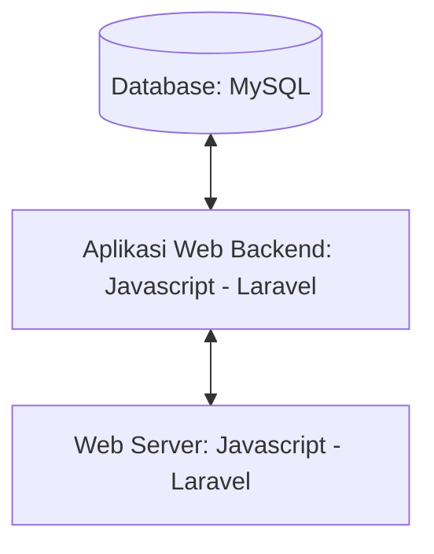

# 1.1 Latar Belakang

Online shop semakin berkembang melalui internet bahkan sekarang segala sesuatu pun menjadi praktis. Melalui perubahan gaya hidup yang terjadi disini saya berinisiatif untuk membuat sebuah toko online/e-commerce yang bertujuann untuk mempermudah seseorang ketika ingin berbelanja. Bahkan dengan toko online kita tidak hanya mencakup daerah sekitar saja tetapi juga luar daerah bahkan mencakup internasional yang tentunya ini seharusnya lebih efektif untuk menyebarluaskan produk yang kita jual.

Berbelanja secara online saat ini sudah menjadi trend modern yang dinikmati oleh sebagian besar masyarakat, karena mampu menarik dan menggoda bagi setiap masyarakat. Karena berbelanja tidak bisa lepas dari diri kehidupan kita, hampir tidak ada masyarakat yang tidak menyukai belanja, apalagi masyarakat modern yang sudah pasti kebanyakan memiliki internet. Hal ini yang menjadi alasan saya untuk membuat sebuah website e-commerce.

# 1.2. Deksripsi Teknologi Informasi

Pada pembuatan aplikasi kali ini saya menggunakan beberapa teknologi informasi diantaranya :
1. Database menggunakan ***Mysql*** untuk melakukan pengelolaan data pada website yang saya buat,
2. Bagian Frontend saya menggunakan beberapa kombinasi seperti ***CSS***, ***BOOTSTRAP***, dan ***JAVASCRIPT***, ***Vue JS***
3. Bagian Backendnya saya menggunakan ***PHP*** dibarengi dengan frameworknya yaitu ***LARAVEL***,
4. Untuk Design awal aplikasinya saya menggunakan ***FIGMA***,
5. Untuk Membuat programnya saya menggunakan aplikasi ***Visual Studio Code***,
6. Operasi ***OS*** menggunakan ***Linux***

# 1.3. Branding

- Merk: Rstore
- Tagline: "Gaya Hidup dalam Satu Tempat"
- Campaign:  Tempat yang menggabungkan seluruh aspek gaya hidup Anda dalam satu tempat yang nyaman dan inspiratif. Kami yakin bahwa gaya -hidup Anda adalah refleksi dari siapa Anda, dan kami siap membantu Anda menjalani hidup yang lebih baik dan berwarna.
- Target user:
    - Usia 12+
    - Seorang yang senang up to date
    - Seorang yang senang mengeksplorasi hal baru
    - Seorang yang ingin memiliki suasana baru
    - Seorang yang ingin memiliki barang berkualitas
- User experience theme:
    - Sederhana
    - Konten mudah terbaca
    - Profesionalisme
    - warna: warna putih memiliki kesan kesederhanaan dan bersih dibalut aksen biru juga dapat memberikan kesan kepercayaan kepada pengguna
    - Inspirasi desain : 

# 2. User Story

sebagai | saya ingin bisa | sehingga | Prioritas
---|---|---|---
pengguna | melihat daftar produk tersedia | bisa memilih produk yang tersedia disetiap toko | ⭐⭐⭐⭐⭐
pengguna | mencari produk | bisa memudahkan saya dalam menemukan produk yang sedang dicari | ⭐⭐⭐⭐⭐
pengguna | memiliki keranjang | bisa menambahkan produk ke keranjang belanja saya | ⭐⭐⭐⭐⭐
pengguna | melihat keranjang | bisa melihat daftar produk yang telah saya tambahkan ke keranjang belanja | ⭐⭐⭐⭐⭐
pengguna | memasukan alamat | bisa  menentukan alamat pengiriman paket  | ⭐⭐⭐⭐⭐
pengguna | membeli produk | bisa  membawa pulang produk yang dipilih  | ⭐⭐⭐⭐⭐
pengguna | melihat detail produk | bisa  melihat produk yang dipilih secara menyeluruh  | ⭐⭐⭐⭐
pengguna | menghapus produk dari keranjang | bisa  diganti dengan produk lain dan tidak menumpuk  | ⭐⭐⭐⭐
pengguna | melihat ringkasan pesanan | sebelum mengkonfirmasi pembelian bisa dilakukan cek ulang | ⭐⭐⭐
pengguna | mendapatkan notif pesanan | bisa mengetahui pesanan sudah diproses atau belum | ⭐⭐⭐
pengguna | melihat reveiw produk | bisa melihat feedback dari yang sudah pernah pesan | ⭐⭐⭐
pengguna | mendapatkan rekomendasi produk | saya dapat menemukan produk menarik atau relevan dengan preferensi saya. | ⭐⭐⭐⭐
pengguna | menyimpan produk favorit | saya dapat dengan cepat menemukannya di kunjungan berikutnya. | ⭐⭐⭐⭐
pengguna | melacak status pengiriman | saya bisa memantau kapan pesanan saya akan tiba. | ⭐⭐⭐⭐
pengguna | memberikan feedback produk | saya dapat berpartisipasi dalam meningkatkan kualitas produk | ⭐⭐⭐⭐
pengguna | mendapatkan informasi promo atau diskon, | saya bisa memanfaatkan penawaran khusus. | ⭐⭐⭐⭐
pengguna | opsi pembayaran yang beragam, | saya memiliki fleksibilitas dalam pembayaran. | ⭐⭐⭐⭐
pengguna | mengelola preferensi akun, | saya dapat mengatur detail akun dan preferensi pribadi saya. | ⭐⭐⭐⭐
pengguna | melihat ulasan produk langsung dari pelanggan, | saya mendapatkan gambaran yang lebih akurat tentang kualitas produk. | ⭐⭐⭐⭐
pengguna | mendapatkan notifikasi tentang produk yang sedang diskon, | saya dapat segera memanfaatkan penawaran tersebut. | ⭐⭐⭐⭐
pengguna | mengatur ulang kata sandi dengan mudah, | saya dapat menjaga keamanan akun saya. | ⭐⭐⭐⭐
pengguna | menyimpan beberapa alamat pengiriman, | saya memiliki opsi untuk mengirimkan pesanan ke berbagai lokasi. | ⭐⭐⭐⭐
pengguna | melihat estimasi ongkos kirim sebelum pembelian, | saya bisa menyesuaikan pesanan saya dengan anggaran. | ⭐⭐⭐⭐
pengguna | opsi pengiriman yang beragam, | saya bisa memilih metode pengiriman yang paling sesuai. | ⭐⭐⭐⭐
pengguna | memberikan ulasan setelah menerima produk, | saya dapat berbagi pengalaman dengan pelanggan lain. | ⭐⭐⭐⭐
pengguna | kemudahan dalam menghubungi layanan pelanggan, | saya dapat dengan cepat memperoleh bantuan jika diperlukan. | ⭐⭐⭐⭐
pengguna | opsi pengembalian produk, | saya bisa dengan mudah mengembalikan produk yang tidak sesuai. | ⭐⭐⭐⭐
pengguna | opsi pemberitahuan jika produk sedang habis, | saya tidak kecewa setelah memilih produk yang tidak tersedia. | ⭐⭐⭐⭐
pengguna | melihat tutorial penggunaan produk, | saya dapat memaksimalkan manfaat produk yang saya beli. | ⭐⭐⭐⭐
pengguna | opsi untuk mendapatkan faktur digital, | saya dapat menyimpan catatan pembelian dengan mudah. | ⭐⭐⭐⭐
pengguna | tautan langsung ke produk terkait, |  saya dapat dengan cepat menelusuri produk yang serupa. | ⭐⭐⭐⭐
pengguna | menyimpan riwayat pembelian, | saya dapat melacak produk yang pernah saya beli sebelumnya. | ⭐⭐⭐⭐
pengguna | melihat rating toko atau penjual, | saya dapat membuat keputusan pembelian yang lebih informasional. | ⭐⭐⭐⭐
pengguna | melihat tutorial penggunaan produk, | saya dapat memaksimalkan manfaat produk yang saya beli. | ⭐⭐⭐⭐
pengguna | mendapatkan notifikasi ketika produk yang diinginkan tersedia, | saya tidak melewatkan kesempatan untuk membeli. | ⭐⭐⭐⭐
pengguna | opsi untuk mengatur waktu pengiriman, | saya dapat menerima pesanan pada waktu yang sesuai bagi saya. | ⭐⭐⭐⭐
pengguna | opsi untuk membatalkan pesanan, | saya memiliki fleksibilitas jika perlu mengubah keputusan pembelian. | ⭐⭐⭐⭐
pengguna | opsi pengiriman internasional, | ssaya bisa membeli produk dari luar negeri. | ⭐⭐⭐⭐
pengguna | melihat tutorial penggunaan produk, | saya dapat memaksimalkan manfaat produk yang saya beli. | ⭐⭐⭐⭐
pengguna | melihat tutorial penggunaan produk, | saya dapat memaksimalkan manfaat produk yang saya beli. | ⭐⭐⭐⭐
penjual | memiliki dasbor yang intuitif | saya dapat dengan mudah mengelola dan memantau produk saya. | ⭐⭐⭐⭐⭐
penjual | menambahkan produk baru,| saya dapat memperbarui katalog toko saya secara teratur. | ⭐⭐⭐⭐⭐
penjual | memperbarui stok produk secara otomatis, | saya tidak kehabisan stok secara tidak terduga. | ⭐⭐⭐⭐⭐
penjual | melihat analisis penjualan, | saya dapat membuat keputusan berdasarkan data yang akurat. | ⭐⭐⭐⭐⭐
penjual | mengelola pesanan pelanggan dengan mudah, | saya dapat memberikan layanan yang efisien. | ⭐⭐⭐⭐⭐
penjual | memberikan diskon atau promo, | saya dapat menarik lebih banyak pelanggan. | ⭐⭐⭐⭐⭐
penjual | mendapatkan notifikasi pesanan baru, | saya dapat mengatasi pesanan dengan cepat. | ⭐⭐⭐⭐⭐
penjual | mengelola ulasan produk, | saya dapat meningkatkan kualitas produk dan layanan. | ⭐⭐⭐⭐⭐
penjual | menyediakan opsi pengiriman yang fleksibel, | aya dapat memenuhi kebutuhan beragam pelanggan. | ⭐⭐⭐⭐⭐
penjual | memberikan informasi produk yang jelas, | pelanggan dapat membuat keputusan pembelian dengan percaya diri. | ⭐⭐⭐⭐⭐
penjual | mendapatkan umpan balik dari pelanggan, | saya dapat terus meningkatkan kualitas layanan. | ⭐⭐⭐⭐⭐
penjual | menyusun promo atau penawaran khusus, | saya dapat meningkatkan daya tarik toko saya. | ⭐⭐⭐⭐⭐
penjual | menyediakan fitur langganan produk, | pelanggan dapat berlangganan produk secara reguler. | ⭐⭐⭐⭐⭐
penjual | menyediakan panduan penggunaan produk, | pelanggan dapat memaksimalkan manfaat produk. | ⭐⭐⭐⭐⭐
penjual | memberikan notifikasi diskon atau penawaran kepada pelanggan setia, | saya dapat mempertahankan pelanggan yang loyal. | ⭐⭐⭐⭐⭐
penjual | memasarkan toko saya secara online, | dapat menjangkau pelanggan potensial lebih luas. | ⭐⭐⭐⭐⭐
penjual | menyediakan opsi pembelian dalam jumlah besar (grosir), | dapat menarik pelanggan bisnis atau pembelian dalam jumlah besar. | ⭐⭐⭐⭐⭐
penjual | memudahkan pelanggan menghubungi layanan pelanggan, | pertanyaan atau masalah dapat segera diatasi. | ⭐⭐⭐⭐⭐
penjual | menyediakan opsi pengembalian barang, | pelanggan merasa aman dalam melakukan pembelian. | ⭐⭐⭐⭐⭐
penjual | memberikan akses ke promo atau penawaran eksklusif bagi pelanggan tertentu, | dapat meningkatkan loyalitas pelanggan. | ⭐⭐⭐⭐⭐
penjual | memantau performa iklan atau promosi, | saya dapat menilai efektivitas kampanye pemasaran. | ⭐⭐⭐⭐⭐
penjual | memberikan pemberitahuan jika stok produk hampir habis, | saya dapat mengelola stok dengan lebih baik. | ⭐⭐⭐⭐⭐
penjual | menyediakan opsi pengiriman gratis, | apat menarik lebih banyak pelanggan. | ⭐⭐⭐⭐⭐
penjual | memberikan opsi pre-order untuk produk yang akan datang, | pelanggan dapat memesan produk terbaru sebelum dirilis. | ⭐⭐⭐⭐⭐
penjual | menyediakan opsi untuk mengatur jam operasional toko online, | pelanggan tahu kapan dapat melakukan pembelian atau menghubungi toko. | ⭐⭐⭐⭐⭐
penjual | menyediakan opsi penukaran atau pengembalian dana, | pelanggan merasa aman dalam melakukan transaksi. | ⭐⭐⭐⭐⭐
penjual | menyediakan panduan ukuran atau spesifikasi produk, | pelanggan dapat membuat keputusan pembelian yang lebih tepat. | ⭐⭐⭐⭐⭐
penjual | menyediakan opsi langganan newsletter, | dapat membangun hubungan lebih lanjut dengan pelanggan. | ⭐⭐⭐⭐⭐
penjual | menyediakan opsi pre-order dengan pembayaran paruh atau penuh, | pelanggan dapat memesan produk eksklusif. | ⭐⭐⭐⭐⭐
penjual | menyediakan opsi program loyalitas, | dapat mempertahankan pelanggan setia. | ⭐⭐⭐⭐⭐
penjual | melihat statistik penjualan produk, | saya dapat mengevaluasi performa bisnis saya. | ⭐⭐⭐⭐⭐
penjual | memberikan opsi pengiriman internasional, | dapat menjangkau pasar global. | ⭐⭐⭐⭐
penjual | melihat statistik kunjungan ke toko online saya, | saya dapat menilai efektivitas kampanye pemasaran. | ⭐⭐⭐⭐⭐
penjual | opsi untuk mengatur stok minimum, | saya dapat meminimalkan risiko kehabisan stok. | ⭐⭐⭐⭐
penjual | mendapatkan informasi produk yang paling diminati, | saya bisa menyesuaikan stok dan promosi. | ⭐⭐⭐⭐
penjual | menyusun kategori produk dengan jelas, | pembeli dapat dengan mudah menavigasi toko saya. | ⭐⭐⭐⭐
penjual | opsi untuk menonaktifkan ulasan produk, | saya dapat mengontrol informasi yang ditampilkan. | ⭐⭐⭐⭐
penjual | opsi untuk menyembunyikan stok produk, | pesaing tidak dapat melihat persediaan saya. | ⭐⭐⭐⭐
penjual | menyediakan garansi atau kebijakan pengembalian, | spembeli merasa lebih percaya diri dalam berbelanja. | ⭐⭐⭐⭐
penjual | mengelola daftar pelanggan yang terdaftar, | dapat melakukan promosi khusus kepada mereka. | ⭐⭐⭐⭐
penjual | opsi untuk menyusun penawaran bundel produk, | dapat mendorong pembelian lebih banyak. | ⭐⭐⭐⭐
penjual | opsi untuk menyembunyikan produk sementara, | dapat melakukan perubahan atau penyesuaian. | ⭐⭐⭐⭐⭐
penjual | memberikan opsi pembayaran dengan sistem cicilan, | pembeli dapat membeli produk dengan lebih mudah. | ⭐⭐⭐⭐⭐
penjual | menyediakan opsi pemesanan langganan, | pelanggan dapat berlangganan produk secara berkala. | ⭐⭐⭐⭐⭐
admin | memiliki dasbor analitik, | saya dapat melihat performa keseluruhan toko dengan cepat. | ⭐⭐⭐⭐⭐
admin | dapat mengelola produk dengan mudah, | saya bisa menambah, menghapus, atau memperbarui inventaris toko. | ⭐⭐⭐⭐⭐
admin | memiliki sistem manajemen stok otomatis, | saya dapat melihat performa keseluruhan toko dengan cepat. | ⭐⭐⭐⭐⭐
admin | dapat melihat laporan penjualan,| saya dapat menganalisis kinerja platform dan membuat keputusan berdasarkan data. | ⭐⭐⭐⭐⭐
admin | memiliki sistem manajemen pesanan, | saya bisa memantau dan mengelola status pesanan dengan efisien. | ⭐⭐⭐⭐⭐
admin | dapat mengelola informasi penjual, | saya dapat memberikan dukungan yang lebih baik dan memahami preferensi penjual. | ⭐⭐⭐⭐⭐
admin | memonitor ulasan produk, | saya dapat memahami umpan balik pengguna dan meresponsnya. | ⭐⭐⭐⭐⭐
admin | dapat mengelola promosi dan diskon platform, | saya bisa meningkatkan daya tarik platform. | ⭐⭐⭐⭐⭐
admin | memiliki sistem manajemen pengguna, | saya dapat mengatur peran dan izin dengan mudah. | ⭐⭐⭐⭐⭐
admin | memiliki fungsi pencarian dan filter, | saya bisa dengan cepat menemukan informasi penting di dalam sistem. | ⭐⭐⭐⭐⭐
admin | memiliki sistem notifikasi, | saya bisa mendapatkan pemberitahuan tentang peristiwa penting dalam platform. | ⭐⭐⭐⭐⭐
admin | dapat melihat aktivitas pengguna, | saya bisa memantau interaksi di platform. | ⭐⭐⭐⭐
admin | memiliki sistem manajemen kategori produk, | saya bisa mengorganisir produk dengan baik. | ⭐⭐⭐⭐
admin | dapat mengelola informasi platform, | saya bisa memperbarui detail platform dengan mudah. | ⭐⭐⭐⭐
admin | memiliki fitur pencadangan data otomatis, | saya bisa melindungi data penting platform. | ⭐⭐⭐⭐
admin | dapat mengatur ulang kata sandi pengguna platform, | saya bisa membantu pengguna yang lupa kata sandi. | ⭐⭐⭐
admin | menyediakan dukungan pelanggan langsung, | saya bisa memberikan bantuan segera kepada pengguna. | ⭐⭐⭐
admin | memiliki sistem manajemen retur, | saya bisa mengelola proses pengembalian produk. | ⭐⭐⭐
admin | dapat melihat riwayat aktivitas admin,, | saya bisa melacak perubahan yang dilakukan dalam sistem. | ⭐⭐⭐
admin | memiliki sistem manajemen promosi ulang tahun pengguna, | saya bisa merayakan hari istimewa bersama pengguna. | ⭐⭐⭐
admin | dapat melihat statistik kunjungan platform, | saya dapat memahami perilaku pengunjung dan meningkatkan pengalaman mereka. | ⭐⭐⭐
admin | dapat mengelola opsi pembayaran internasional, | splatform dapat menjangkau pengguna global. | ⭐⭐⭐

# 3. Struktur Data

Cara membuat aneka macam bentuk grafik menggunakan mermaid.js bisa lihat di [https://mermaid.js.org/syntax/entityRelationshipDiagram.html](https://mermaid.js.org/syntax/entityRelationshipDiagram.html) 

```mermaid
---
title:  Rstore
---
erDiagram
    kategori ||--o{ produk_galeri : produk kategori {
        int id PK
        varchar nama
        varchar slug
} produk_galeri ||--o{ produk : view produk_galeri {
        int id PK
        varchar photo
        int produk_id
} produk ||--o{ keranjang : places produk {
        int id PK
        varchar nama
        int users_id FK
        int harga
        text deskripsi
        int kategori_id FK
} keranjang ||--|{ pengguna : save keranjang {
        int id PK
        int produk_id FK
        int users_id FK
} pengguna ||..|{ transaksi : procces pengguna {
        int id PK
        varchar nama
        varchar email
        varchar password
        text alamat_1
        text alamat_2
        int provinsi_id
        int kabupaten_id
        int kode_pos
        varchar negara
        varchar nomor_telepon
        varchar nama_toko
        int kategori_id FK
        int status_toko
} transaksi }|..|{ detail_transaksi : payment transaksi {
        int id PK
        int users_id FK
        int harga_diskon
        int harga_pengiriman
        int total_harga
        varchar status_transaksi
        varchar resi
} detail_transaksi {
        int id PK
        int transaksi_id
        int produk_id
        int harga
}

    
```

# 4. Arsitektur Sistem

# 5. Teknologi, Library, dan Framework

### VScode

- **Penjelasan Singkat:**
    > Visual Studio Code (VSCode) adalah sebuah editor kode sumber yang ringan, cepat, dan gratis yang dikembangkan oleh Microsoft. Meskipun dikenal dengan dukungan terbaik untuk pengembangan web, VSCode juga dapat digunakan untuk berbagai bahasa pemrograman lainnya. Ini memiliki ekosistem ekstensi yang luas yang memungkinkan pengguna menyesuaikan dan memperluas fungsionalitas sesuai kebutuhan mereka.
- **Cara Penggunaan:**
    >
    > Ada beberapa shortcut keyboard yang bisa dipakai agar kamu lebih mudah ketika menggunakan aplikasi Visual Studio Code di Windows. Berikut adalah daftarnya:
    - Ctrl + Shift + P: menampilkan Command Palette
    - Ctrl + P: membuka file.
    - Ctrl + Shift + N: membuat Window baru. 
    - Ctrl + Shift + W: menutup Window.
    - Ctrl + X; memotong line
    - Ctrl + C: copy line. 
    - Alt + ↑ / ↓: berpindah ke line atas atau bawah. 
    - Shift + Alt  + ↓ / ↑: copy line atas atau bawah. 
    - Ctrl + Shift + K: menghapus line
    - Ctrl + Home: menuju awal file.
    - Ctrl + End: menuju file paling akhir. 
    - Ctrl + ↑ / ↓: scroll line ke atas atau ke bawah. 
    - Alt + PgUp / PgDn: scroll halaman ke atas atau ke bawah. 
    - Ctrl + N: membuat file baru. 
    - Ctrl + O: membuka file baru.
    - Ctrl + S: simpan. 
    - Ctrl + F4: tutup aplikasi. 

Untuk teknologi pendukung saya menggunakan Visual Studio Code Sedangkan library memakai yang ada di laravel untuk Framework saya menggunakan  Laravel

# 6. Desain User Experience dan User Interface

## Design UI & UX Menggunakan Figma
### Link Figma
> https://www.figma.com/file/3W3UI6PfdxKsZ4kcWn42hB/RStore?type=design&node-id=22%3A489&mode=design&t=1iLHJnMXjgig2YmL-1
- **Landing Page**
    > 
- Sign **In**
    > 
- **Dashboard**
    > 
- **Admin Page**
    > 

## 7. Demonstrasi Video

Link youtube nya

## 8. Bagaimana mesin komputasi dan sistem operasi berperan dalam produk teknologi informasimu ?

Link youtube nya di detik jawaban ini

## 9. Bagaimana algoritma, struktur data, dan bahasa pemrograman berperan dalam produk teknologi informasimu ?

Link youtube nya di detik jawaban ini

## 10. Bagaimana metode pengembangan perangkat lunak / Software Development Life Cycle berperan dalam produk teknologi informasimu ?

Link youtube nya di detik jawaban ini

## 11. Bagaimana database / sistem basis data berperan dalam produk teknologi informasimu ?

Link youtube nya di detik jawaban ini
