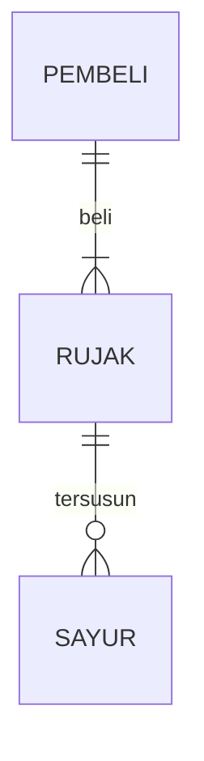
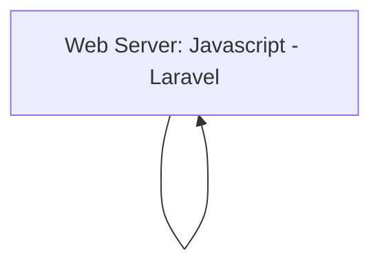

## 1.1 Latar Belakang

Online shop semakin berkembang melalui internet bahkan sekarang segala sesuatu pun menjadi praktis. Melalui perubahan gaya hidup yang terjadi disini saya berinisiatif untuk membuat sebuah toko online/e-commerce yang bertujuann untuk mempermudah seseorang ketika ingin berbelanja. Bahkan dengan toko online kita tidak hanya mencakup daerah sekitar saja tetapi juga luar daerah bahkan mencakup internasional yang tentunya ini seharusnya lebih efektif untuk menyebarluaskan produk yang kita jual.

Berbelanja secara online saat ini sudah menjadi trend modern yang dinikmati oleh sebagian besar masyarakat, karena mampu menarik dan menggoda bagi setiap masyarakat. Karena berbelanja tidak bisa lepas dari diri kehidupan kita, hampir tidak ada masyarakat yang tidak menyukai belanja, apalagi masyarakat modern yang sudah pasti kebanyakan memiliki internet. Hal ini yang menjadi alasan saya untuk membuat sebuah website e-commerce.

## 1.2. Deksripsi Teknologi Informasi

bla bla bla

## 1.3. Branding

- Merk: Rstore
- Tagline: "Gaya Hidup dalam Satu Tempat"
- Campaign:  Tempat yang menggabungkan seluruh aspek gaya hidup Anda dalam satu tempat yang nyaman dan inspiratif. Kami yakin bahwa gaya -hidup Anda adalah refleksi dari siapa Anda, dan kami siap membantu Anda menjalani hidup yang lebih baik dan berwarna.
- Target user:
    - Usia 12+
    - Seorang yang senang up to date
    - Seorang yang senang mengeksplorasi hal baru
    - Seorang yang ingin memiliki suasana baru
    - Seorang yang ingin memiliki barang berkualitas
- User experience theme:
    - Sederhana
    - Konten mudah terbaca
    - Profesionalisme
    - warna: warna putih memiliki kesan kesederhanaan dan bersih dibalut aksen biru juga dapat memberikan kesan kepercayaan kepada pengguna

## 2. User Story

sebagai | saya ingin bisa | sehingga | Prioritas
---|---|---|---
pengguna | melihat daftar produk tersedia | bisa memilih produk yang tersedia disetiap toko | ⭐⭐⭐⭐⭐
pengguna | mencari produk | bisa memudahkan saya dalam menemukan produk yang sedang dicari | ⭐⭐⭐⭐⭐
pengguna | memiliki keranjang | bisa menambahkan produk ke keranjang belanja saya | ⭐⭐⭐⭐⭐
pengguna | melihat keranjang | bisa melihat daftar produk yang telah saya tambahkan ke keranjang belanja | ⭐⭐⭐⭐⭐
pengguna | memasukan alamat | bisa  menentukan alamat pengiriman paket  | ⭐⭐⭐⭐⭐
pengguna | membeli produk | bisa  membawa pulang produk yang dipilih  | ⭐⭐⭐⭐⭐
pengguna | melihat detail produk | bisa  melihat produk yang dipilih secara menyeluruh  | ⭐⭐⭐⭐
pengguna | menghapus produk dari keranjang | bisa  diganti dengan produk lain dan tidak menumpuk  | ⭐⭐⭐⭐
pengguna | melihat ringkasan pesanan | sebelum mengkonfirmasi pembelian bisa dilakukan cek ulang | ⭐⭐⭐
pengguna | mendapatkan notif pesanan | bisa mengetahui pesanan sudah diproses atau belum | ⭐⭐⭐
pengguna | melihat reveiw produk | bisa melihat feedback dari yang sudah pernah pesan | ⭐⭐⭐

## 3. Struktur Data

Cara membuat aneka macam bentuk grafik menggunakan mermaid.js bisa lihat di [https://mermaid.js.org/syntax/entityRelationshipDiagram.html](https://mermaid.js.org/syntax/entityRelationshipDiagram.html) 

## 4. Arsitektur Sistem

## 5. Teknologi, Library, dan Framework

bla bla bla

## 6. Desain User Experience dan User Interface

Bisa load image 

## 7. Demonstrasi Video

Link youtube nya

## 8. Bagaimana mesin komputasi dan sistem operasi berperan dalam produk teknologi informasimu ?

Link youtube nya di detik jawaban ini

## 9. Bagaimana algoritma, struktur data, dan bahasa pemrograman berperan dalam produk teknologi informasimu ?

Link youtube nya di detik jawaban ini

## 10. Bagaimana metode pengembangan perangkat lunak / Software Development Life Cycle berperan dalam produk teknologi informasimu ?

Link youtube nya di detik jawaban ini

## 11. Bagaimana database / sistem basis data berperan dalam produk teknologi informasimu ?

Link youtube nya di detik jawaban ini
